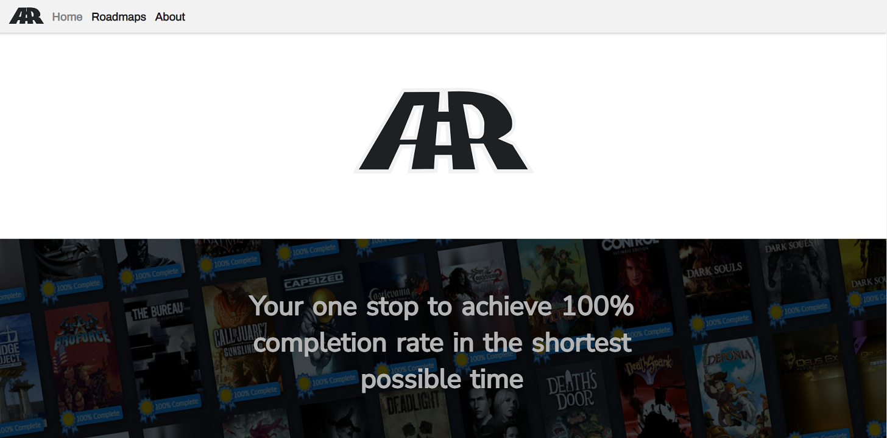

# BLOG

Visit the website [here](https://www.achievementroadmaps.com/)

### A Video Game Blog

This is still a work in progress project. Made with Nodejs and Expressjs with the purpose of using mongoDB in the future. The plan is to eventually become a proper blog, with authentication, authorization and CRUD operations, among other features.

It includes the following:

- EJS for templating
- FS module from nodejs
- Parsing data from Steam Web API
